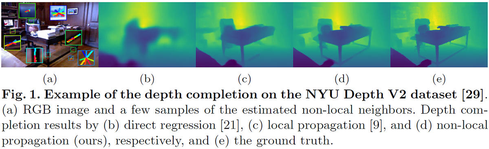
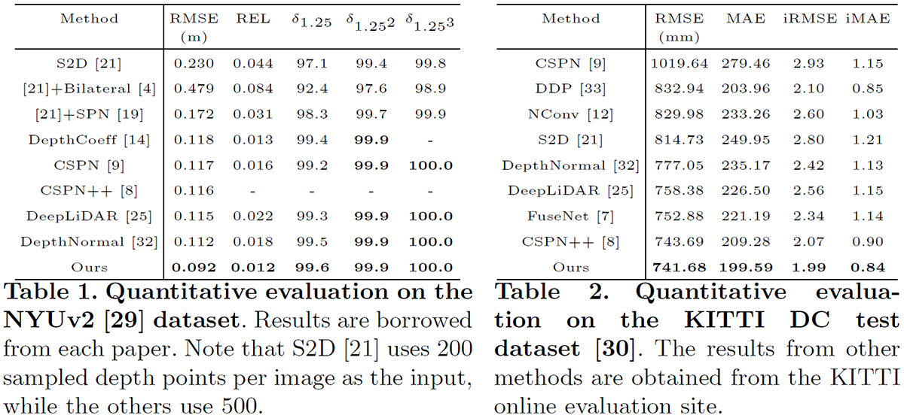
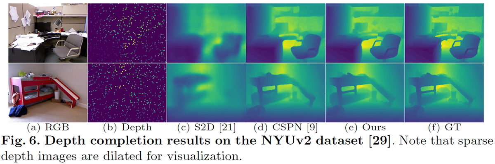
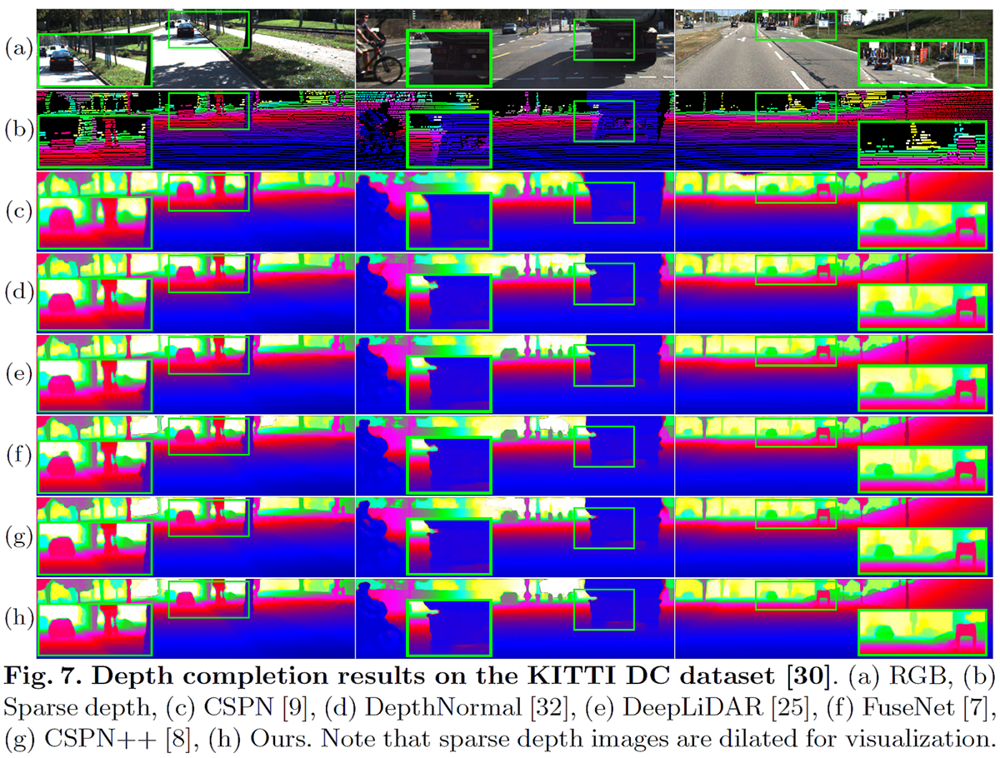

Non-Local Spatial Propagation Network for Depth Completion
----------

#### [Jinsun Park](https://zzangjinsun.github.io), [Kyungdon Joo](https://kdjoo369.wixsite.com/kdjoo), [Zhe Hu](https://zjuela.github.io/), Chi-Kuei Liu and In So Kweon

#### _European Conference on Computer Vision (ECCV), Aug 2020_


### News

* Jan. 2021 : Confidence issue fixed. Please refer to [#16](https://github.com/zzangjinsun/NLSPN_ECCV20/issues/16) for the details.

* Dec. 2020 : [Winner, Qualcomm Innovation Fellowship Korea (QIFK) 2020](https://www.qualcomm.com/invention/research/university-relations/innovation-fellowship/winners)

* Oct. 2020 : Pretrained models are released. Please refer to [here](#pre-trained-models-and-results).

### Introduction



In this paper, we propose a robust and efficient end-to-end non-local spatial propagation network for depth completion. The proposed network takes RGB and sparse depth images as inputs and estimates non-local neighbors and their affinities of each pixel, as well as an initial depth map with pixel-wise confidences. The initial depth prediction is then iteratively refined by its confidence and non-local spatial propagation procedure based on the predicted non-local neighbors and corresponding affinities. Unlike previous algorithms that utilize fixed-local neighbors, the proposed algorithm effectively avoids irrelevant local neighbors and concentrates on relevant non-local neighbors during propagation. In addition, we introduce a learnable affinity normalization to better learn the affinity combinations compared to conventional methods. The proposed algorithm is inherently robust to the mixed-depth problem on depth boundaries, which is one of the major issues for existing depth estimation/completion algorithms. Experimental results on indoor and outdoor datasets demonstrate that the proposed algorithm is superior to conventional algorithms in terms of depth completion accuracy and robustness to the mixed-depth problem. Our implementation is publicly available on the project page.


### Results








### Citation

Our paper is available in [ECCV 2020 Proceedings](http://www.ecva.net/papers/eccv_2020/papers_ECCV/html/1810_ECCV_2020_paper.php) or [arXiv](https://arxiv.org/abs/2007.10042).

```
@inproceedings{park2020non,
    title={Non-Local Spatial Propagation Network for Depth Completion},
    author={Park, Jinsun and Joo, Kyungdon and Hu, Zhe and Liu, Chi-Kuei and Kweon, In So},
    booktitle={Proc. of European Conference on Computer Vision (ECCV)},
    year={2020}
}
```


### Dependencies

Our released implementation is tested on:

- Ubuntu 16.04 / Ubuntu 18.04
- Python 3.8 (Anaconda 4.8.4)
- PyTorch 1.6 / torchvision 0.7
- Tensorboard 2.3
- NVIDIA CUDA 10.2
- NVIDIA Apex
- [Deformable Convolution V2](https://arxiv.org/abs/1811.11168)
- 4x NVIDIA GTX 1080 TI / 4x NVIDIA Titan RTX GPUs


#### NVIDIA Apex

We used NVIDIA Apex (commit @ 4ef930c1c884fdca5f472ab2ce7cb9b505d26c1a) for multi-GPU training.

Apex can be installed as follows:

```bash
$ cd PATH_TO_INSTALL
$ git clone https://github.com/NVIDIA/apex
$ cd apex
$ git reset --hard 4ef930c1c884fdca5f472ab2ce7cb9b505d26c1a
$ pip install -v --no-cache-dir --global-option="--cpp_ext" --global-option="--cuda_ext" ./ 
```


#### Deformable Convolution V2 (DCNv2)

Build and install DCN module.

```bash
$ cd NLSPN_ROOT/src/model/deformconv
$ sh make.sh
```

The DCN module in this repository is from [here](https://github.com/xvjiarui/Deformable-Convolution-V2-PyTorch) but some function names are slightly different.

Please refer to the [PyTorch DCN](https://github.com/chengdazhi/Deformable-Convolution-V2-PyTorch) for the original implementation.


### Usage


#### Dataset

We used two datasets for training and evaluation.

#### NYU Depth V2 (NYUv2)

We used preprocessed NYUv2 HDF5 dataset provided by [Fangchang Ma](https://github.com/fangchangma/sparse-to-dense).

```bash
$ cd PATH_TO_DOWNLOAD
$ wget http://datasets.lids.mit.edu/sparse-to-dense/data/nyudepthv2.tar.gz
$ tar -xvf nyudepthv2.tar.gz
```

After that, you will get a data structure as follows:

```
nyudepthv2
├── train
│    ├── basement_0001a
│    │    ├── 00001.h5
│    │    └── ...
│    ├── basement_0001b
│    │    ├── 00001.h5
│    │    └── ...
│    └── ...
└── val
    └── official
        ├── 00001.h5
        └── ...
```

Note that the original full NYUv2 dataset is available at the [official website](https://cs.nyu.edu/~silberman/datasets/nyu_depth_v2.html).

After preparing the dataset, you should generate a json file containing paths to individual images.

```bash
$ cd NLSPN_ROOT/utils
$ python generate_json_NYUDepthV2.py --path_root PATH_TO_NYUv2
```

Note that data lists for NYUv2 are borrowed from the [CSPN repository](https://github.com/XinJCheng/CSPN/tree/master/cspn_pytorch/datalist).


#### KITTI Depth Completion (KITTI DC)

KITTI DC dataset is available at the [KITTI DC Website](http://www.cvlibs.net/datasets/kitti/eval_depth.php?benchmark=depth_completion).

For color images, KITTI Raw dataset is also needed, which is available at the [KITTI Raw Website](http://www.cvlibs.net/datasets/kitti/raw_data.php).

Please follow the official instructions (cf., devkit/readme.txt in each dataset) for preparation.

After downloading datasets, you should first copy color images, poses, and calibrations from the KITTI Raw to the KITTI DC dataset.

```bash
$ cd NLSPN_ROOT/utils
$ python prepare_KITTI_DC.py --path_root_dc PATH_TO_KITTI_DC --path_root_raw PATH_TO_KITTI_RAW
```

After that, you will get a data structure as follows:

```
.
├── depth_selection
│    ├── test_depth_completion_anonymous
│    │    ├── image
│    │    ├── intrinsics
│    │    └── velodyne_raw
│    ├── test_depth_prediction_anonymous
│    │    ├── image
│    │    └── intrinsics
│    └── val_selection_cropped
│        ├── groundtruth_depth
│        ├── image
│        ├── intrinsics
│        └── velodyne_raw
├── train
│    ├── 2011_09_26_drive_0001_sync
│    │    ├── image_02
│    │    │     └── data
│    │    ├── image_03
│    │    │     └── data
│    │    ├── oxts
│    │    │     └── data
│    │    └── proj_depth
│    │        ├── groundtruth
│    │        └── velodyne_raw
│    └── ...
└── val
    ├── 2011_09_26_drive_0002_sync
    └── ...
```

After preparing the dataset, you should generate a json file containing paths to individual images.

```bash
$ cd NLSPN_ROOT/utils

# For Train / Validation
$ python generate_json_KITTI_DC.py --path_root PATH_TO_KITTI_DC

# For Online Evaluation Data
$ python generate_json_KITTI_DC.py --path_root PATH_TO_KITTI_DC --name_out kitti_dc_test.json --test_data
```


#### Training

```bash
$ cd NLSPN_ROOT/src

# An example command for NYUv2 dataset training
$ python main.py --dir_data PATH_TO_NYUv2 --data_name NYU  --split_json ../data_json/nyu.json \
    --patch_height 228 --patch_width 304 --gpus 0,1,2,3 --loss 1.0*L1+1.0*L2 --epochs 20 \
    --batch_size 12 --max_depth 10.0 --num_sample 500 --save NAME_TO_SAVE

# An example command for KITTI DC dataset training
$ python main.py --dir_data PATH_TO_KITTI_DC --data_name KITTIDC --split_json ../data_json/kitti_dc.json \
    --patch_height 240 --patch_width 1216 --gpus 0,1,2,3 --loss 1.0*L1+1.0*L2 --epochs 20 \
    --batch_size 12 --max_depth 90.0 --num_sample 0 --top_crop 100 --test_crop --save NAME_TO_SAVE
```

Please refer to the config.py for more options.

During the training, tensorboard logs are saved under the experiments directory. To run the tensorboard:

```bash
$ cd NLSPN_ROOT/experiments
$ tensorboard --logdir=. --bind_all
```

Then you can access the tensorboard via http://YOUR_SERVER_IP:6006


#### Testing

```bash
$ cd NLSPN_ROOT/src

# An example command for NYUv2 dataset testing
$ python main.py --dir_data PATH_TO_NYUv2 --data_name NYU  --split_json ../data_json/nyu.json \
    --patch_height 228 --patch_width 304 --gpus 0,1,2,3 --max_depth 10.0 --num_sample 500 \
    --test_only --pretrain PATH_TO_WEIGHTS --save NAME_TO_SAVE

# An example command for KITTI DC dataset testing
$ python main.py --dir_data PATH_TO_KITTI_DC --data_name KITTIDC --split_json ../data_json/kitti_dc.json \
    --patch_height 240 --patch_width 1216 --gpus 0,1,2,3 --max_depth 90.0 --num_sample 0 \
    --test_only --pretrain PATH_TO_WEIGHTS --save NAME_TO_SAVE
```

To generate KITTI DC Online evaluation data:

```bash
$ cd NLSPN_ROOT/src
$ python main.py --dir_data PATH_TO_KITTI_DC --data_name KITTIDC --split_json ../data_json/kitti_dc_test.json \
    --patch_height 240 --patch_width 1216 --gpus 0,1,2,3 --max_depth 90.0 --num_sample 0 \
    --test_only --pretrain PATH_TO_WEIGHTS --save_image --save_result_only --save NAME_TO_SAVE
```

Images for submission can be found in experiments/NAME_TO_SAVE/test/epoch%04d.


#### Pre-trained Models and Results

We release our pre-trained models on the [NYU](https://drive.google.com/file/d/1LTdZI36zdOeVmKRbG3orzvwXctg-OjGC/view?usp=sharing) and [KITTI DC](https://drive.google.com/file/d/11by_1oglcncSHFeF3S2ldcysQYjyDcQh/view?usp=sharing) datasets.

Download pre-trained models and put them in the _NLSPN_ROOT/results_ directory.

__For the KITTI DC dataset, results with the released model are slightly better than those reported in the paper.__

| Type | RMSE (mm) | MAE | iRMSE | iMAE |
|:----:|:---------:|:---:|:-----:|:----:|
| Online Test Set (Paper) | 741.68 | 199.59 | 1.99 | __0.84__ |
| Online Test Set (Released) | __740.66__ | __198.70__ | __1.96__ | __0.84__ |
| Validation Set (Released) | 771.8 | 197.3 | 2.0 | 0.8

For the NYU dataset, results are the same.

To get quantitative results reported in the paper:

```bash
$ cd NLSPN_ROOT/src

# An example command for NYUv2 dataset testing
$ python main.py --dir_data PATH_TO_NYUv2 --data_name NYU  --split_json ../data_json/nyu.json \
    --patch_height 228 --patch_width 304 --gpus 0,1,2,3 --max_depth 10.0 --num_sample 500 \
    --test_only --pretrain ../results/NLSPN_NYU.pt --preserve_input --save NAME_TO_SAVE --legacy

# An example command for KITTI DC dataset testing
$ python main.py --dir_data PATH_TO_KITTI_DC --data_name KITTIDC --split_json ../data_json/kitti_dc.json \
    --patch_height 240 --patch_width 1216 --gpus 0,1,2,3 --max_depth 90.0 --num_sample 0 \
    --test_only --pretrain ../results/NLSPN_KITTI_DC.pt --preserve_input --save NAME_TO_SAVE --legacy

# An example command for KITTI DC Online evaluation data generation
$ python main.py --dir_data PATH_TO_KITTI_DC --data_name KITTIDC --split_json ../data_json/kitti_dc_test.json \
    --patch_height 240 --patch_width 1216 --gpus 0,1,2,3 --max_depth 90.0 --num_sample 0 \
    --test_only --pretrain ../results/NLSPN_KITTI_DC.pt --preserve_input --save_image --save_result_only \
    --save NAME_TO_SAVE --legacy
```

**Please do not forget to use *--legacy* flag to reproduce our results.**

Note that result images can be saved with *--save_image --save_result_only* flags.

We also release our prediction results on two datasets (Refer to the [NYU](results/NLSPN_NYU_results.zip) and [KITTI DC Online Submission](https://drive.google.com/file/d/1M3SfzCD96rHgaJYqV0sTagZJus_VzRra/view?usp=sharing) files).

They are saved in the KITTI submission format.

To get real depth values, use the following conversion: __depth = double(image) / 256.0__


### Notes

- Our original implementation was based on old libraries (e.g., PyTorch 1.2 / torchvision 0.4 / Python 3.6). We cleaned and updated our implementation for this release.
- The original NYUv2 / KITTI DC results in the paper were obtained with a powerful machine equipped with 8 NVIDIA P40 GPUs. From my experiences, **the larger batch you use, the better performance you get**.
